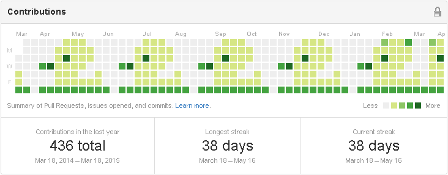

Draw on your GitHub Public Contributions chart
==============================================

Why
---
Skilled, active developers don't always contribute to Public repos only.  
Yet future employers may judge you by your public contributions chart.  
To correct this wrong, hack your chart!

Demo
----

How
---
- (or [skip to TL;DR](#tldr) below).
- On Github:
  - Make a new public repo `pch-chart`.  Don't generate any files.
  - Perhaps explain in description: 'Because my main work is in private repos!'

- On your computer:
  - Create an empty folder `pch-chart`.
  - Go there and add this repo's scripts `patternToDates.js` and `dates.sh`.
  - Run:  
    `$ git init`
  - Make a textfile that defines what to draw on your chart,  
    e.g. `pattern-duck.txt`.  
    It's a matrix where each character corresponds to the yellow/green intensity you want  
    to add to a day's tile in the chart. (We'll generate X commits for these days).  
    The file should have 7 lines (one per weekday, with Sunday on line 1 as on GitHub),  
    that should all have equal length. Just append spaces if needed.  
    Use matrix values:
    - 0 or space: remain gray,
    - 1: light-green,
    - 2: greener,
    - etc. A to Z corresponds to 10-35, and a-x to 36-59.  
    
    Note:
      - We only increase a tile's intensity, so if a tile wasn't grey before, it'll be more green.
      - Intensity can become lighter if days with many commits were already on the chart.  
        Compensate with different values in the pattern file, e.g. try 4->A, 3->5, etc.
      - I had to experiment a bout to find out when GitHub would switch to yellow/lightgreen tiles,  
        instead of showing similar shades of green only. I found that the chart needed a pattern  
        with at least one day of 10 contributions, one of 4, and perhaps several of 3.
  - Use NodeJS to generate a file with corresponding date-times, e.g.:  
    `$ node patternToDates.js pattern-duck.txt`  
    This will place the drawing rightmost, with its bottom-right tile on the latest Saturday.  
    If you want to draw starting at a certain Sunday, with its top-left tile there, use like:  
    `$ node patternToDates.js pattern-duck.txt "11 Jan 2015"`.  
    This will generate a file `dates.txt`, e.g:  
    `Oct 07 2014 12:01`  
    `Oct 07 2014 12:02`  
    `Oct 15 2014 12:01`  
    You can edit this file if you wish.
  - Add `dates.sh` from `github.com/stcruy/public-contrib-hack`, and make it executable:  
    `$ chmod +x dates.sh`
  - To generate a commit for each of these datetimes to your `pch-chart` repo, run:  
    `$ ./dates.sh`
  - Then push these commits to your GitHub repo:  
    `$ git remote add origin git@github.com:<YOUR_USERNAME_HERE>/pch-chart.git`  
    `$ git push -u origin master`
  - Done!
  - Star and share this repo ;)
  - If you want to remove these commits from your chart (perhaps to draw new things):
    - On GitHub: delete your repo `pch-chart`.
    - On your computer: delete the hidden `.git` folder.
    

TL;DR: just fill my chart with ducks!
-------------------------------------
- Make GitHub repo `pch-chart`.
- Run in local shell:  
`mkdir pch-chart`  
`cd pch-chart`  
`curl -o pattern-ducks.txt https://raw.githubusercontent.com/stcruy/public-contrib-hack/master/pattern-ducks.txt`  
`curl -o patternToDates.js https://raw.githubusercontent.com/stcruy/public-contrib-hack/master/patternToDates.js`  
`curl -o dates.sh https://raw.githubusercontent.com/stcruy/public-contrib-hack/master/dates.sh`  
`chmod +x dates.sh`  
  
`git init`  
`git remote add origin git@github.com:<YOUR_USERNAME_HERE>/pch-chart.git`  
`node patternToDates.js pattern-ducks.txt`  
`./dates.sh`  
`git push -u origin master`  

- To queue a duck that will slide in view during the upcoming weeks, add:  
`curl -o pattern-duck.txt https://raw.githubusercontent.com/stcruy/public-contrib-hack/master/pattern-duck.txt`  
`node patternToDates.js pattern-duck.txt "<1ST_SUNDAY_AFTER_MOST_RECENT_SATURDAY_HERE_eg:>15 Mar 2015"`  
`./dates.sh`  
`git push -u origin master`

License
-------
[CC BY-NC-SA](https://creativecommons.org/licenses/by-nc-sa/4.0/)

Credits
-------
Inspired by adamschwartz's [hack](https://github.com/public-contributions/HACK).

Made by [Steven Vercruysse](https://github.com/stcruy) while in Norway.
